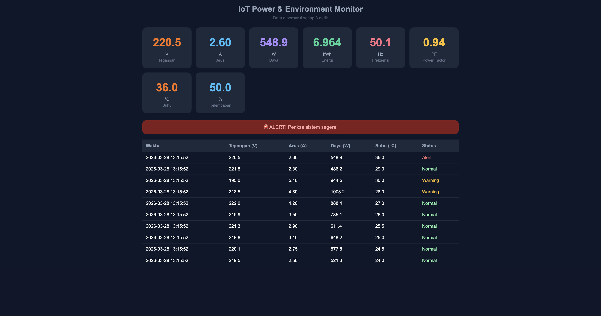

# IoT Power & Environment Monitor

Sistem monitoring listrik dan lingkungan berbasis ESP32 dengan web dashboard real-time.

## Fitur
- Monitor tegangan, arus, daya, energi (simulasi PZEM-004T)
- Monitor suhu & kelembaban (DHT22)
- Tampilan LCD 20x4 lokal
- LED indikator status WiFi
- Buzzer & relay alarm otomatis
- RTC untuk timestamp akurat
- Web dashboard real-time (Flask)
- Database SQLite untuk histori data
- Alert otomatis (Normal/Warning/Alert)

## Hardware
- ESP32
- DHT22 (suhu & kelembaban)
- PZEM-004T (pengukur listrik)
- LCD 20x4 I2C
- RTC DS1307
- Relay module
- Buzzer
- LED indikator
- HLK-PM01 (power supply)

## Teknologi
- C++ (Arduino IDE) — firmware ESP32
- Python 3 + Flask — web server
- SQLite — database
- HTML/CSS/JavaScript — dashboard

## Cara Menjalankan
1. Clone repo ini
2. Install dependencies: pip3 install flask
3. Jalankan server: python3 app.py
4. Buka browser: http://127.0.0.1:8080

## Screenshot

## Simulasi
Proyek ini bisa disimulasi di Wokwi.com tanpa hardware fisik.
Link simulasi: [Wokwi Project](https://wokwi.com)
